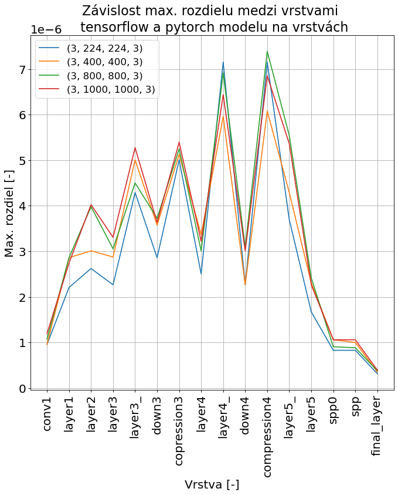

# DDRNet-Tensorflow
Toto repo obsahuje všetky materialy, ktroé boli použité alebo vyprodukované k vypracovaniu práce, ktorá sa zaoberala použitím siete DDRNet 23 slim pre real time v aplikácií moobilného robora, ktoré májú obmedzený hardver. 

Vrámci implementácie bola architektúra DDRNet 23 slim vytvorená pomocou frameworku Tensorflow s namapovanými váhami predtrénovanej siete od autorov modelu. Nasledujúci graf ukazuje max. rozdiel medzi hodnotami pôvodného modelu a premanovaného. 

Tensorflow implementation of DDRNet 23 slim with pretrained model

Tensorflow ver.: 2.8.0
